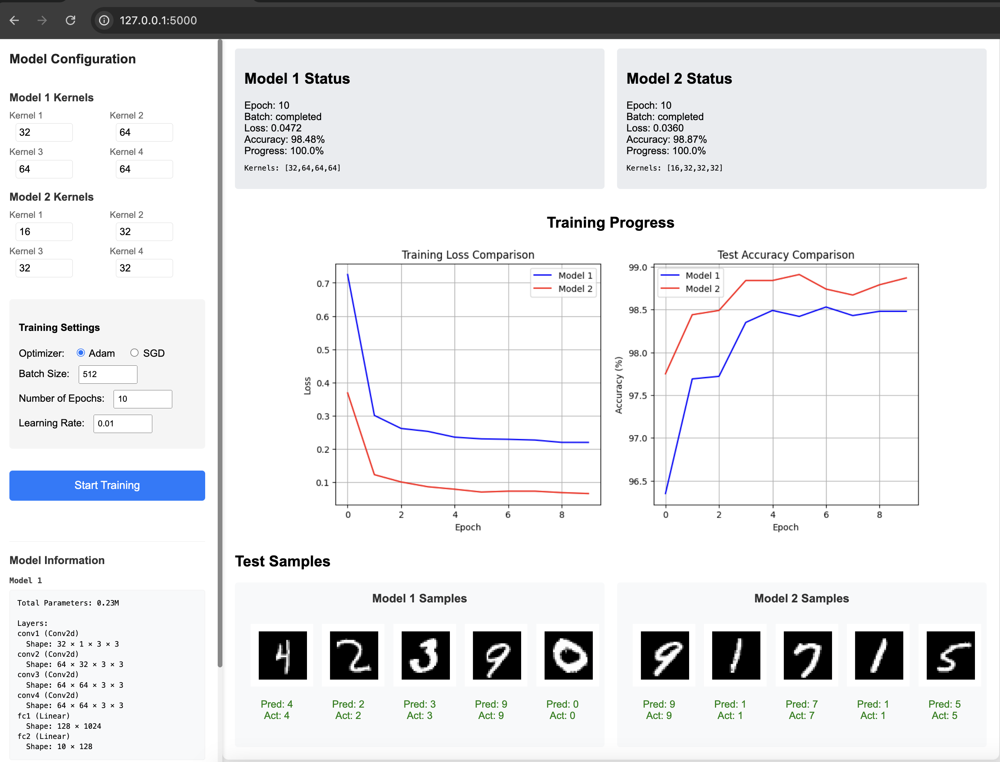

# MNIST Training Monitor

A real-time web-based monitoring system for training Convolutional Neural Networks (CNNs) on the MNIST dataset. This system provides live updates on training progress, loss curves, and sample predictions through an intuitive web interface.

Coding Tool: Cursor

## Table of Contents

- [Demo Screenshot](#demo-screenshot)
- [Features](#features)
- [Requirements](#requirements)
- [Installation](#installation)
- [Usage](#usage)
- [Hardware Requirements](#hardware-requirements)
- [Customization](#customization)
- [Contributing](#contributing)
- [Technical Details](#technical-details)

## Demo Screenshot



## Features

- **Real-time Monitoring**: View current training status including epoch, batch number, loss, accuracy, and overall progress.
- **Live-Updating Plots**: Visualize training loss and accuracy curves that update in real-time.
- **Sample Predictions**: Display sample predictions on test data with indicators for correct and incorrect classifications.
- **Model Information**: Detailed information about each model's architecture and total parameters.
- **Configurable Training Settings**: Adjust model configurations, optimizer choices, batch size, epochs, and learning rate through the web interface.
- **Automatic Cleanup**: Removes old training artifacts to ensure the system remains up-to-date and storage-efficient.


## Requirements

- **Python**: 3.8+
- **Libraries**:
  - PyTorch (`torch`, `torchvision`)
  - Flask for the web server
  - Matplotlib for plotting
  - tqdm for progress bars

## Installation

1. **Clone the Repository**:
    ```bash
    git clone git@github.com:dhairyag/AI_Quest_Lab.git
    cd AI_Quest_Lab/session_04_mnist_training_web_monitor
    ```

2. **Create a Virtual Environment** (optional but recommended):
    ```bash
    python3 -m venv venv
    source venv/bin/activate  # On Windows: venv\Scripts\activate
    ```

3. **Install Dependencies**:
    ```bash
    pip install torch torchvision flask matplotlib tqdm
    ```

## Usage

1. **Start the Flask Server**:
    Open a terminal and navigate to the project directory, then run:
    ```bash
    python server.py
    ```
    The server will start at `http://localhost:5000`.

2. **Access the Web Interface**:
    Open your web browser and navigate to `http://localhost:5000` to view the training monitor.

## Hardware Requirements

- **GPU with CUDA Support**: Recommended for faster training.
- **Alternatives**:
  - **Apple Silicon (MPS)**: Supported for Mac users with Apple Silicon.
  - **CPU**: Training can be performed on the CPU, though it will be significantly slower.

## Customization

- **Model Configuration**:
  - Access the web interface to adjust kernels, optimizer, batch size, epochs, and learning rate before starting training.
  
- **Update Frequencies**:
  - Modify the update intervals in `static/index.html`'s `<script>` section if needed.

## Contributing

Contributions are welcome! Please fork the repository and submit a pull request with your enhancements.

## Technical Details

### Key Components

#### `model.py`
- Implements `MNISTNet` CNN architecture
- 4 configurable convolutional layers (3x3 kernels)
- 2 fully connected layers
- Dropout for regularization
- Configurable kernel sizes: [32,64,64,64] or [16,32,32,32]

#### `train.py`
- Manages training lifecycle and data handling
- Features:
  - MNIST dataset loading and preprocessing
  - Training/validation split
  - Batch processing
  - Loss calculation (CrossEntropyLoss)
  - Optimizer management (Adam/SGD)
  - Real-time metrics logging
  - Model checkpointing

#### `server.py`
- Flask-based web server (port 5000)
- Endpoints:
  - `/`: Serves main monitoring interface
  - `/training_status`: Returns current training metrics
  - `/static/<path>`: Serves static files
- Handles JSON-based communication
- Automatic cleanup of old training files

#### Web Interface (`static/index.html`)
- Real-time training visualization
- Interactive components:
  - Model configuration
  - Training parameter adjustment
  - Live loss/accuracy plots
  - Test sample predictions
- Auto-refreshing metrics (3-second intervals)

### Data Flow


